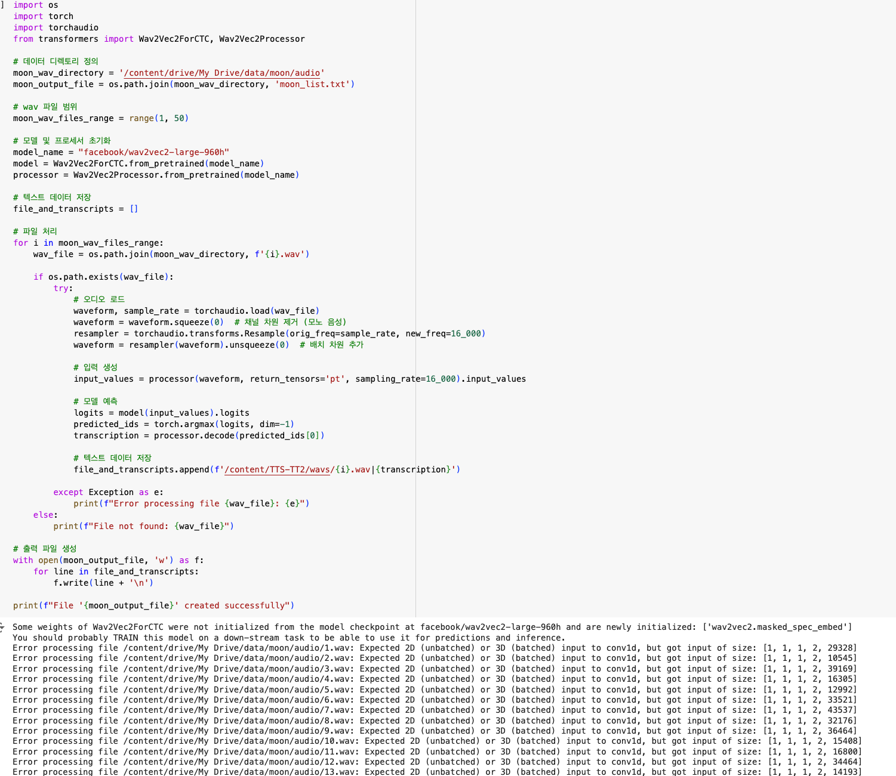

### 📌 문제 사항

> - 
> - 음성 파일로부터 텍스트를 추출하여 텍스트 파일을 작성하는 과정에서 문제 발생
> - 내가 사용하는 모델에서 원하는 텐서 형태는 2D, 3D 이지만, 실제 나의 데이터의 텐서 형태는 4D이다.
> - 즉, 현재 나의 데이터는 모델이 학습할 수 없는 형태의 텐서로 구성되어 있다.

 
 

### 🔎 분석

> - 
> - 텐서란? " 다차원 배열의 일반화된 개념으로, 데이터가 다차원 공간에서 배열되는 방식"
> - 텐서 차원의 해석은 아래와 같음
>   - (1) 1D 텐서: 배열의 크기만 나열한 것.
>   - (2) 2D 텐서: 행렬처럼 가로와 세로로 차원이 나누어짐.
>   - (3) 3D 이상 텐서: 여러 행렬을 포함한 다차원 배열.

 

> - 주요 에러 내용은 다음과 같음. "Expected 2D (unbatched) or 3D (batched) input to conv1d, but got input of size: [1, 1, 2, 29328]"
> - 모델에서는 2D, 3D 형태의 텐서를 기대하지만, 실제 데이터는 4D 텐서로 구성되어 있음
> - [1, 1, 2, 29328] 텐서의 해석
>   - (1) 첫 번째 값 - 1 : 차원의 크기를 의미함. 즉, 데이터가 한 번에 처리되는 개수
>   - (2) 두 번째 값 - 1 : 채널의 수를 의미함. 여기서는 단일 채널을 의미함
>   - (3) 세 번째 값 - 2 : 오디오의 "길이"나 "길이의 부분"을 나타낼 수 있으며, 입력값이 2개 항목으로 구성된 배열
>   - (4) 네 번째 값 - 29328 : 실제 오디오 샘플의 길이(음성 신호의 크기)
> - 정리하자면, 각각 배치 차원, 채널 차원, 특성 차원, 길이 차원을 의미함 

 
 

### 🤔 해결과정 [✅]

> - [241125_텐서크기_불일치_문제.md](241125_%ED%85%90%EC%84%9C%ED%81%AC%EA%B8%B0_%EB%B6%88%EC%9D%BC%EC%B9%98_%EB%AC%B8%EC%A0%9C.md)
> - 근본적인 해결책은 데이터 차원을 축소한다. 물론, 가장 중요치 않은 차원을 없앤다
> - input_values = input_values.squeeze(0) 을 통해서 불필요한 차원을 축소할 수 있음
> - 'tensor.squeeze(dim)' 의 경우,  PyTorch에서 텐서의 크기가 1인 차원을 제거할 때 사용하는 메서드 

